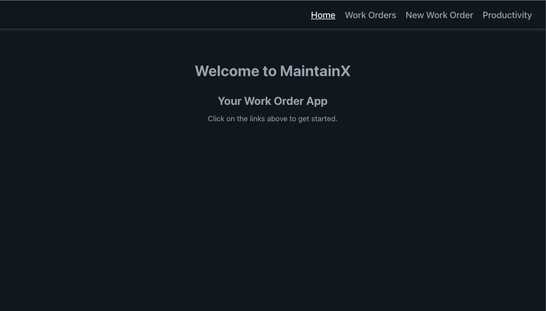
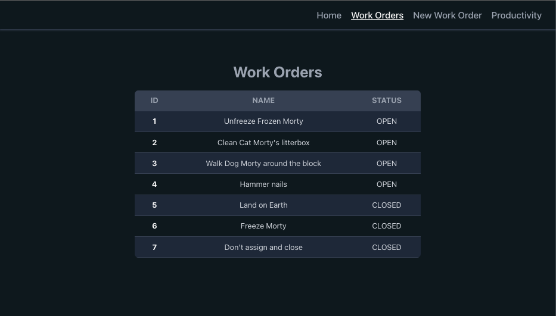
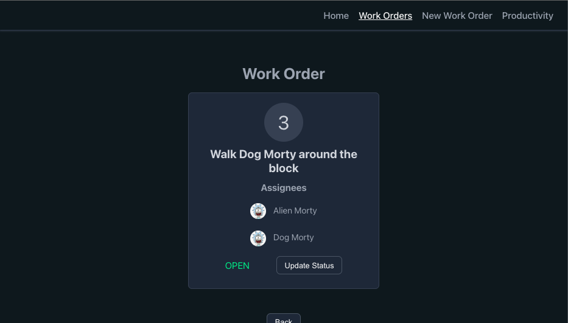
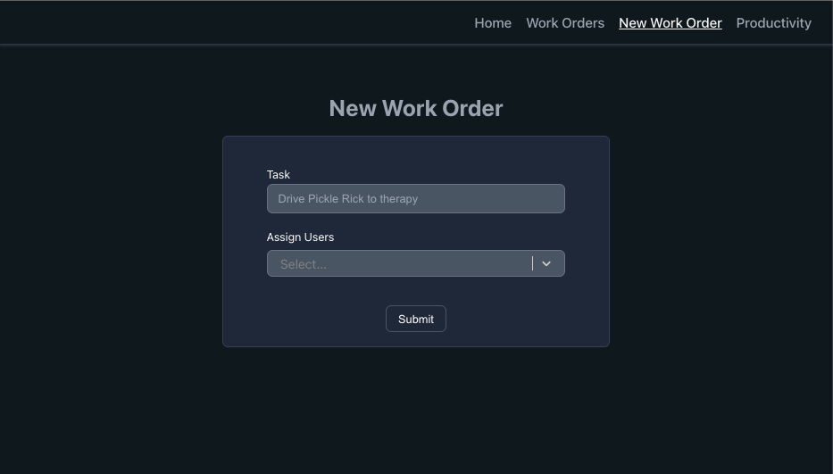
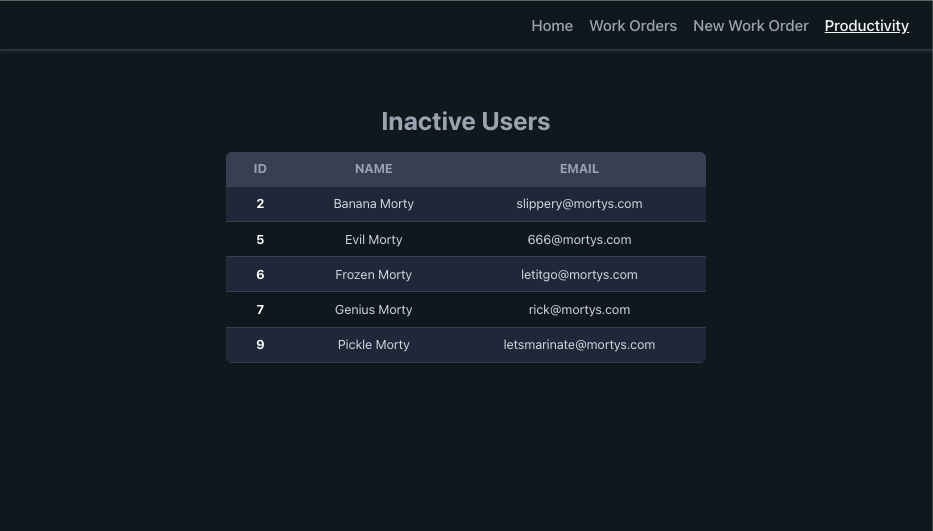

# MaintainX

## The App

A work order app implemented with CRUD operations, reusable react components, custom hooks, and typescript generics.

## Technologies

-   Typescript
-   Node
-   Express
-   SQLite
-   React

## Images

#### Main Page

#### Work Orders List

#### Work Order Detail

#### New Work Order

#### Inactive Users

